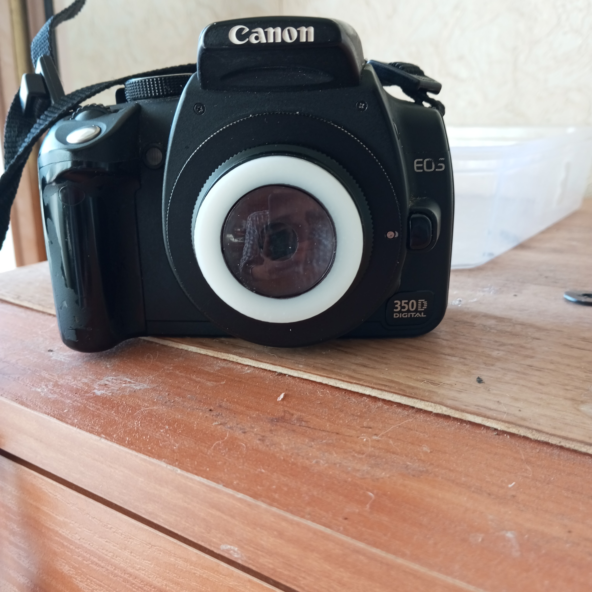

През втората половина на 19 век в Германия са едни от първите, които осъзнават важността на математическите изчисления при проектирането на фотографски лещи и започват да прилагат научни методи в оптико-механичното производство.

Затова през 1865 г. в Мюнхен, под ръководството на учения К.А. Щейнгел се създава експериментален изследователски институт с експериментална оптична и астрономическа работилници. Първоначално основната им задача е да произвеждат лещи за астрономически телескопи. Те също така разработиха нови форми на фотографски лещи. Благодарение на това и влизат в историята.

Първият фотографски обектив, произведен от работилниците през 1865 г., е перископът. Неговият оптичен дизайн се състои от два напълно идентични колективни менискуса, монтирани на определено разстояние един от друг, с техните вдлъбнати страни, обърнати навътре. Диафрагмата е разположена точно по средата между тях.

Тук може да намерите 3D файл за самостоятелна изработка на обектив перископ, фокусното разстояние на обектива е 50 мм. Освен корпуса, който можете да отпечатате на 3D принтер ще са ви необходими и две лещи. За обектова съм ползвал една с диаметър 30 мм и гокусно разстояние 100 мм и една с диаметър 31 мм и фокусно разстояние от 70 мм. Такива лещи можете да си поръчате [тук](https://www.aliexpress.com/item/1005007025214931.html?spm=a2g0o.order_list.order_list_main.8.4af91802WIAskO).

